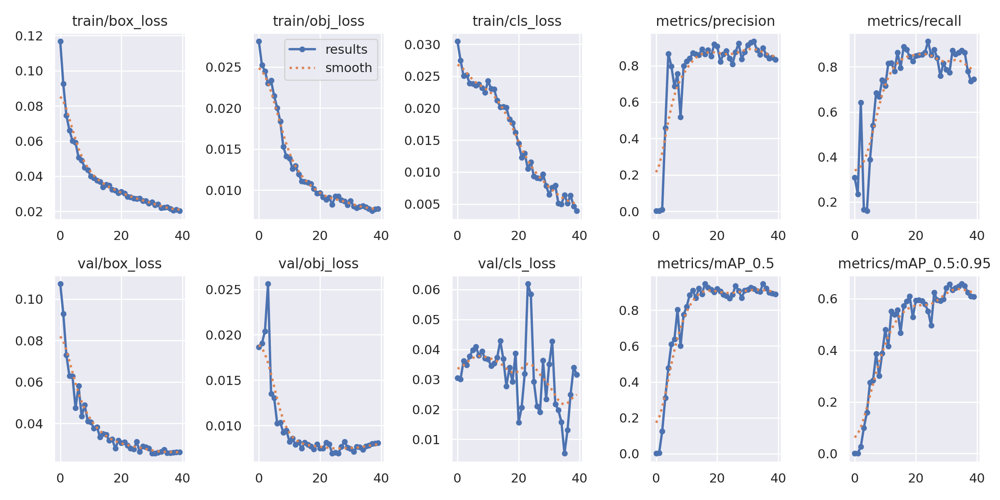
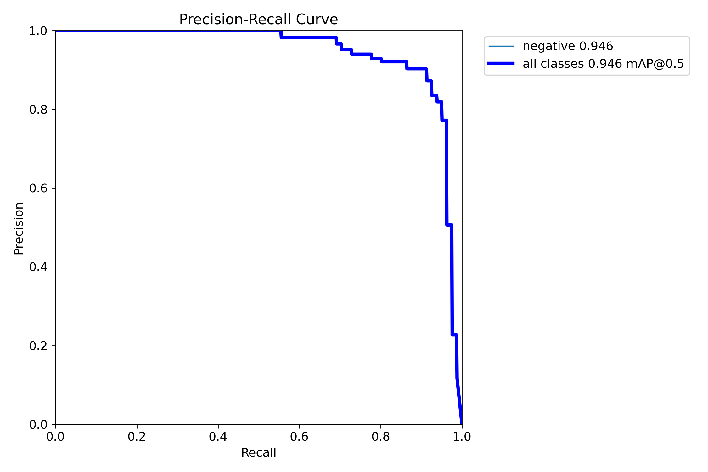
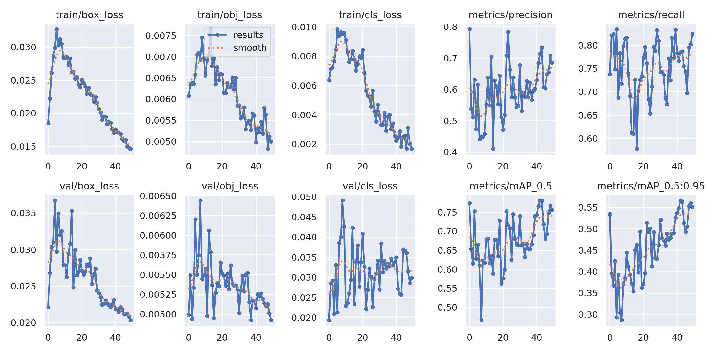
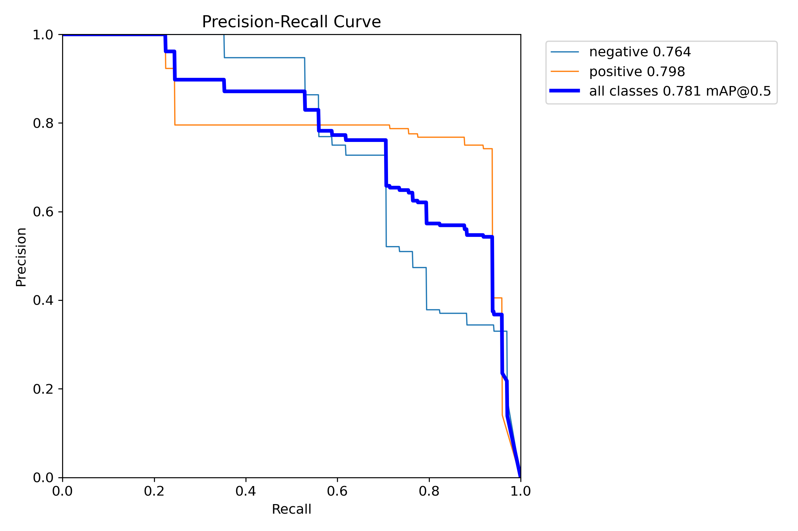
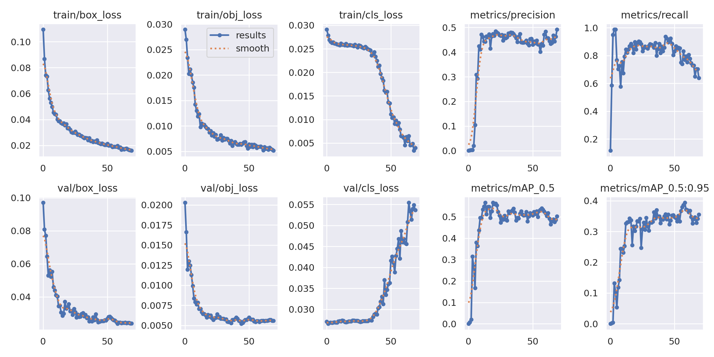
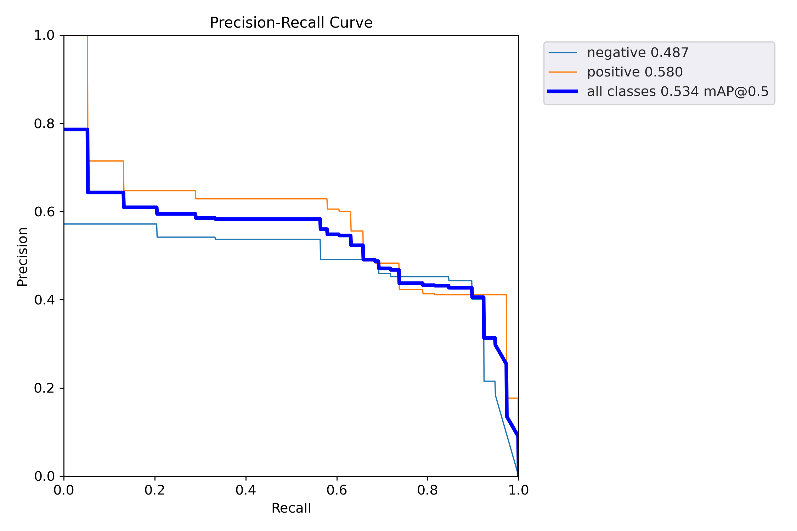
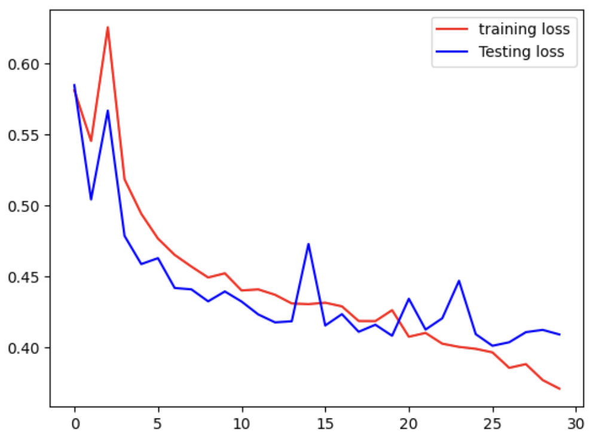
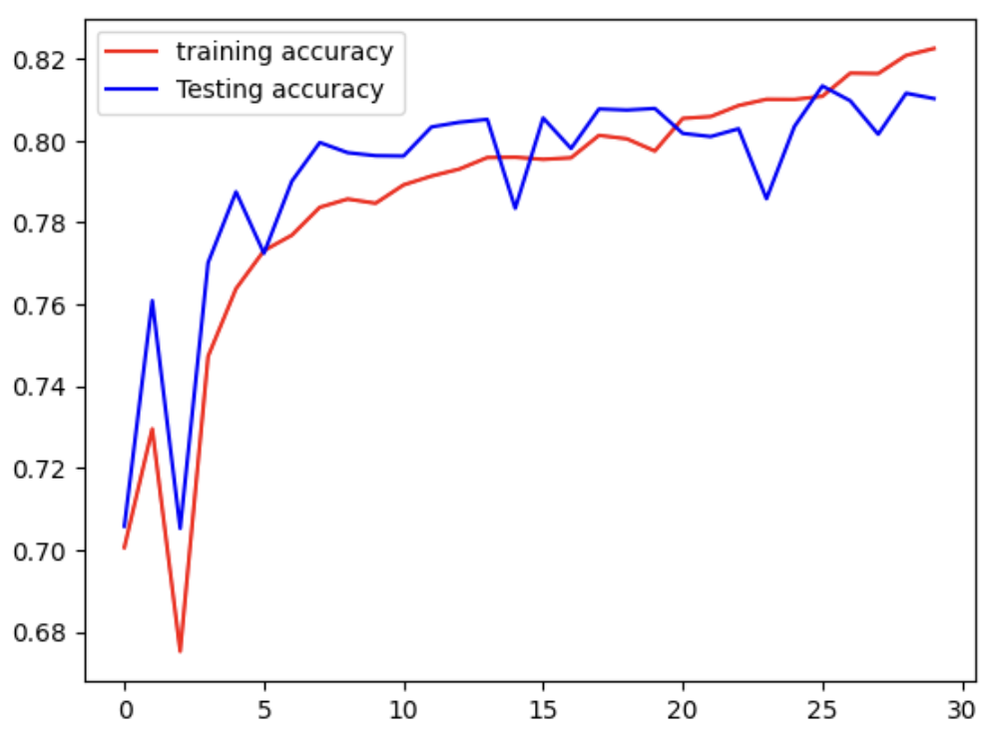

# COMPUTER VISION

## Задачи

* Локализация объектов на изображении
* Бинарная детекция снимков опухолей головного мозга по трем срезам
* Бинарная сегментация лесов по аэро-снимкам

## Реализация и результаты
[Приложение](https://computer-vision-proj.streamlit.app/) развернуто на платформе Streamlit

### Локализация объектов на изображении
* Использовалась модель ResNet18 с добавлением блоков классификации и регрессии
* Модель обучалась на предсказание 3 классов
* Применялась аугментация
* Время обучения модели - 100 эпох
#### Метрики:

### Бинарная детекция снимков опухолей головного мозга
#### Разрезы Axial 
* Использовалась модель YOLOv5s
* Время обучения модели - 40 эпох
##### Метрики:

#### Разрезы Coronal 
* Использовалась модель YOLOv5m
* Время обучения модели - 70 эпох
##### Метрики:

#### Разрезы Sagittal 
* Использовалась модель YOLOv5l
* Время обучения модели - 50 эпох
##### Метрики:

### Бинарная сегментация лесов по аэро-снимкам
* Использовалась модель Unet
* Время обучения модели - 30 эпох
##### Метрики:

